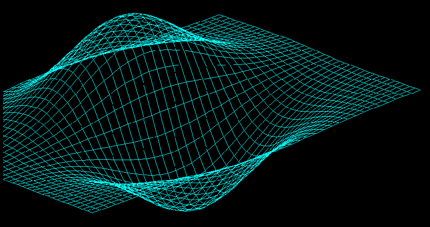
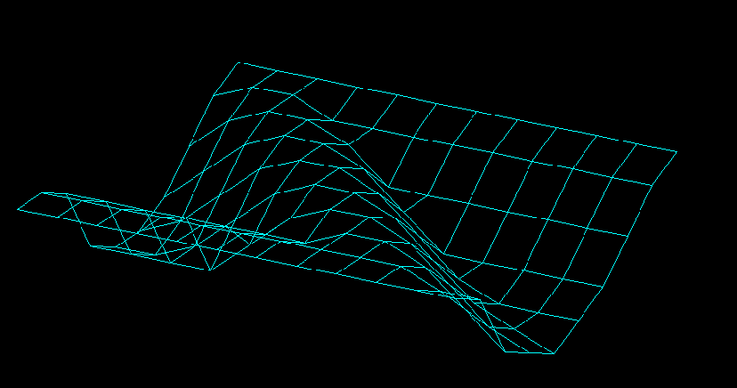
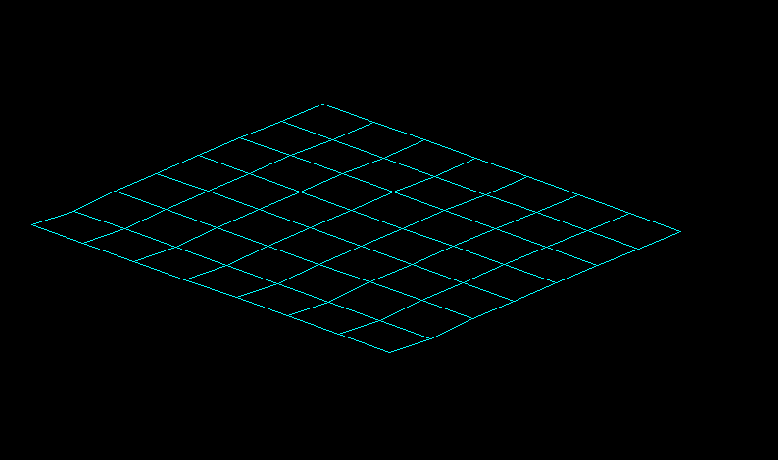
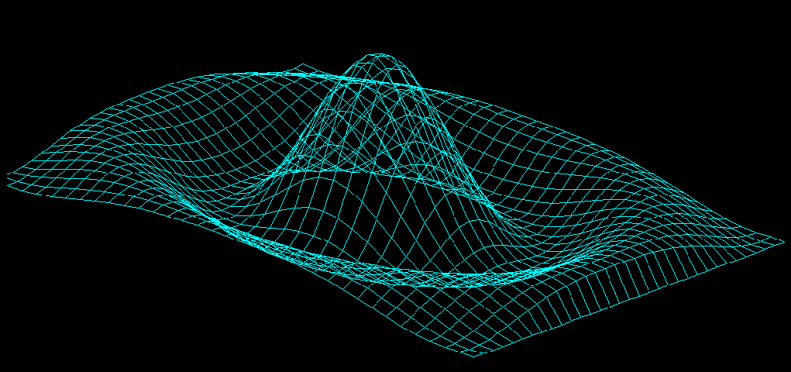

# Isometric Grid Viewer



## Warning

- You might encounter memory leaks when closing the program. It depends, as it seems, whether you use a Nvidia graphics card with SDL2. I'm not entirely sure what is causing them behind the scenes, but I can't seem to fix it. There are **zero** (at least I hope) memory leaks that are caused by myself in this program. Here is a [link](https://forums.developer.nvidia.com/t/asan-reports-memory-leak-in-libnvidia-glcore-so-515-57/222697/2) that could explain you the situation. It sucks, but I can't really do anything about it on my own.
<br />

*P.S : you might not see those memory leaks warnings,because I run `clear` command right after the program ends.*

<br />
<br />
<br />



## __Motivation__ 

- Welp, nothing much to say here . I like C language, and I've wanted to try 3D (or at least a kind of 3D) for a week or two, when I came across this site, [Raising the ground](https://medium.com/@fredhii/rising-the-ground-64957937513b). I found that the idea was interesting and wanted to do it myself. I followed the ideas and eventually managed to scrap the files they used to simulate them, and created some on my own. I'm still working on a generator for such figure, but it's harder than expected. Much thanks to this website and his author.
<br />
<br />
<br />

## __What does it do__ ?
- Basically, you give him a file as a set of z-coordinate points. (x and y are being handled automatically by the program), and it displays the figure that, well, is represented by the z coordinates. It works interestingly, but check out tests examples. They can help you visualize better !

There is a quick example, a simple grid, represented in an isometric view.



## __What did I *learn*__ ?
- Isometric projections, how they work.
- 3D rotations.
- I tried to make a fast `count_lines` function with `getline` and `strtok` but I ended up doing poorly, so I just went back to the easiest method I knew to read the file properly. It might be slow, and I will definitely try to improve it later.

## **Requirements**

- SDL2 is quite obviously a must, since the rendering lib used is SDL2. You can download it on [SDL](https://www.libsdl.org/) (make sure you linked the .dll file correctly, of course) if you're on Windows, or just do 
```ps 
sudo apt get libsdl2-dev
```
if you're on Linux.

On MacOS, I have no clue if it works since I couldn't test it.

- GCC. or any C compiler should do the job. I've tested with GCC and Clang, and it seems to work fine for me. Don't be afraid to open an issue if it doesn't.

## How to install it on your computer ?

- Just clone it wherever you want in your computer.

```ps
git clone https://github.com/Esteban795/isometric-grid.git
```

- After that, head to the directory you cloned it in, and type 
```ps
make build
``` 
- Then, use 
```ps
make run PATH="YourFilePathHere"
```
to run the program on your own file. If you'd prefer to try it on a test file, go ahead and do
```ps
make run PATH="./tests/test2.txt"
```
It should render this : 



## How to use it ?

| Keys        | What they do                  |
|-------------|-------------------------------|
| W           | Moves the figure upwards      |
| A           | Moves the figure to the left  |
| S           | Moves the figure downwards    |
| D           | Moves the figure to the right |
| UP_ARROW    | Top rotation                  |
| DOWN_ARROW  | Down Rotation                 |
| LEFT_ARROW  | Surprinsigly, left rotation   |
| RIGHT_ARROW | Right rotation                |
| ESC         | Quit the program              |

<br />
<br />
<br />

## What's left to do ?

- Improve `read_file` function to make it run faster, using `getline` and `strtok`. I still need time to figure these out.

- Fix some issues with the camera, where it allows you to go far beyond the screen,but also sometimes not completely on the screen. This is annoying.


<br />
<br />
<br />

# Thanks.